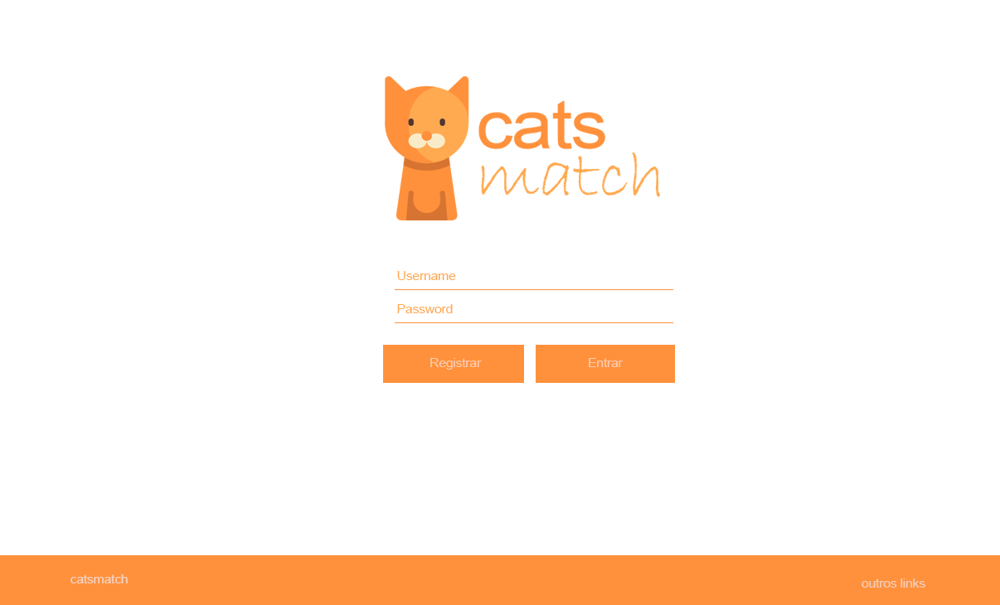
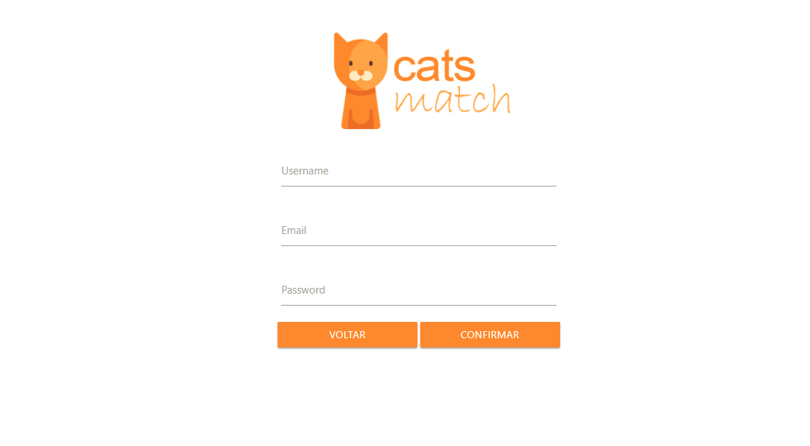
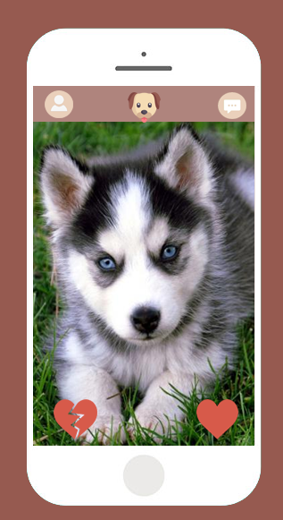

# Documento de Visão do Projeto CATS MATCH :cat:

Este documento apresenta uma solução de software para o projeto *Cats Match*, solicitado pelo cliente *X*, 
apresentando os problemas a serem solucionados, as necessidades dos principais envolvidos, o alcance do projeto e as funcionalidades 
esperadas do sistema.

## Objetivos

* Encontrar um dono para seu gato.
* Amenizar o numero de gatos abandonados.
* Ajudar as pessoas encontrarem um gato.

## Problema

* Descrição do problema: Exitem muitos gatos que precisam de um lar, pois a maioria acabam abandonados ou mortos.
* Quem é afetado pelo problema: Os gatos e alguns donos que precisam de alguém para adota porque não tem dinheiro para manter outro.
* Impacto no negócio: Dificuldade de encontrar um dono.
* Benefícios de uma boa solução: Trazer a felicidade para ambas as partes.

## Definições, abreviações e outros termos do domínio do problema

* Facilitar a adoção dos gatos. 

## Integração com outros sistemas

* Login por facebook
 
## Interessados

* Pessoas que tem gatos.
* Pessoas que querem adotar um gato.

## Usuários

* Pessoas que tem gatos.
* Pessoas que querem adotar gatos.

## Funcionalidades do produto

* Cadastro de gatos.
* Cadastro de pessoas.
* Pagina de match`s para adoção.
* Pagina de Chat.

## Restrições do projeto

* Somente que possui animal de estimação pode cadastrar um animal.
* Nescessario conexão com internet.

## Protótipos de tela

### Protótipos para funcionalidade 1
- Nome 
- Email
- Password
- Upload Foto

### Protótipos para funcionalidade 2
- Nome do animal
- Raça
- Idade
- Descrição
- Upload foto

<!-- ### Protótipos para funcionalidade 3
- Foto do animal, Like or Dislike
- Botão voltar

 -->
