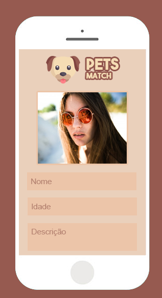
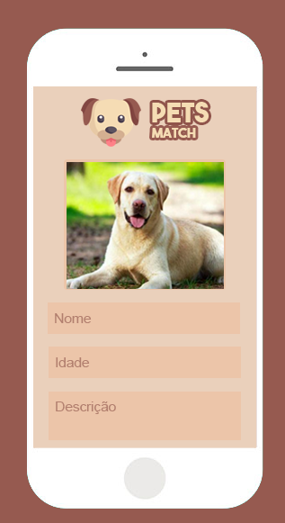

# Documento de Visão do Projeto "NOME DO PROJETO"

Este documento apresenta uma solução de software para o projeto *"NOME DO PROJETO"*, solicitado pelo cliente *"NOME DO CLIENTE"*, 
apresentando os problemas a serem solucionados, as necessidades dos principais envolvidos, o alcance do projeto e as funcionalidades 
esperadas do sistema.

## Objetivos

* Encontrar um par para seu cachorro.
* Encontrar um para o dono.
* Fazer amizades.

## Problema

* Descrição do problema: Muitos donos de cães e gatos tem dificuldades de encontrarem um par compativel com o seu cachorro.
* Quem é afetado pelo problema: Donos dos animais e os animais.
* Impacto no negócio: Dificuldade de encontrar um par perfeito.
* Benefícios de uma boa solução: Trazer a felicidade para ambas as partes.

## Definições, abreviações e outros termos do domínio do problema

* Relacionamento/Entreterimento 

## Integração com outros sistemas

* Login por facebook
* Geolocalização nativo
 
## Interessados

* Pessoas que tem cães e gatos.
* Pessoas que querem relacionamento.

## Usuários

* Pessoas que tem cães e gatos.
* Pessoas que querem relacionamento.
* Alunos do Mackenzie.

## Funcionalidades do produto

* Cadastro da pessoa.
* Cadastro do animal.
* Pagina de match`s.

## Restrições do projeto

* Somente que possui animal de estimação pode cadastrar.
* Nescessario conexão com internet.

## Protótipos de tela

### Protótipos para funcionalidade 1
- Nome (get Facebook)
- Idade
- Descricão
- Upload Foto

Fonte: Exemplos gerados pelo assistente do **Enterprise Architect**.

### Protótipos para funcionalidade 2
- Nome do animal
- Raça
- Idade
- Descrição
- Upload foto

Fonte: Exemplos gerados pelo assistente do **Enterprise Architect**.

### Protótipos para funcionalidade 3
- Foto do animal, Like or Dislike
- Botão voltar

