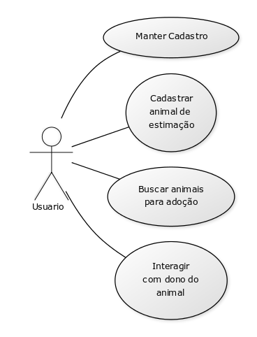

# Casos de uso

## 1. Diagrama de casos de uso

**Instruções do professor**: Insira abaixo o diagrama com os casos de uso do seu sistema. A imagem abaixo é somente um exemplo.

## 2. Especificação dos casos de uso

### 2.1. Caso de uso **MANTER INFORMAÇÕES CADASTRAIS**

| Campo          | Informação        |
|---|---|
| Identificador: | UC01              |
| Nome:          | Manter informações cadastrais |
| Atores:        | Usuário cadastrado |
| Sumário:       | Atualizar informações cadastrais |

| Fluxo Principal |
|---|
| 1) O usuário seleciona a opção de Alterar perfil. |
| 2) O sistema recupera as informações do usuário.                   |
| 3) O sistema apresenta as informações pessoais e fotos cadastradas em um formulário. |
| 4) O usuário realiza as alterações necessárias. |
| 5) O sistema salva as alterações. |

| Fluxo Alternativo (2a): O sistema não encontra as informações do usuário cadastrado. |
|---|
| 1) O sistema informa que não conseguiu recuperar as informações do perfil e exibe a tela para cadastro. |
| 2) O usuário realiza o cadastro. |
| 3) O sistema registra o cadastro do usuário. |
| 4) Volta ao passo (1) do fluxo principal |

### 2.2. Caso de uso **BUSCAR PESSOAS E ANIMAIS**

| Campo          | Informação        |
|---|---|
| Identificador: | UC02              |
| Nome:          | Buscar pessoas e animais |
| Atores:        | Usuário cadastrado |
| Sumário:       | Buscar outros usuários |

| Fluxo Principal |
|---|
| 1) O sistema exibe os usuários de acordo com a análise do usuário logado no sistema. |
| 2) O usuário escolhe a opção"Gostei".                   |
| 3) O sistema exibe o próximo usuário. |

| Fluxo Alternativo (2a): O usuário não escolhe a opção de gostar. |
|---|
| 1) O sistema exibe os usuários de acordo com a análise do usuário logado no sistema. |
| 2) O usuário escolhe a opção "Não Gostei". |
| 3) Volta ao passo (1) do fluxo original |

### 2.3. Caso de uso **INTERAGIR COM PESSOAS E SEUS ANIMAIS**

| Campo          | Informação        |
|---|---|
| Identificador: | UC03              |
| Nome:          | Interagir com pessoas e seus animais |
| Atores:        | Usuário cadastrado |
| Sumário:       | Interagir com outros usuários |

| Fluxo Principal |
|---|
| 1) O sistema verifica os usuários que o usuário logado no sistema gostou e se isso foi retribuido. |
| 2) O sistema exibe um chat para conversar com o usuário que também "gostou" do usuário logado no sistema.                   |

| Fluxo Alternativo (2a): Ninguem "gostou" do usuário logado no sistema. |
|---|
| 1) O sistema informa que nenhum usuário "gostou" do usuário logado no sistema. |
| 2) O sistema volta ao passo (1) do fluxo original |

