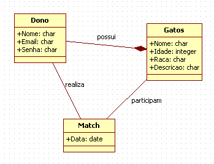
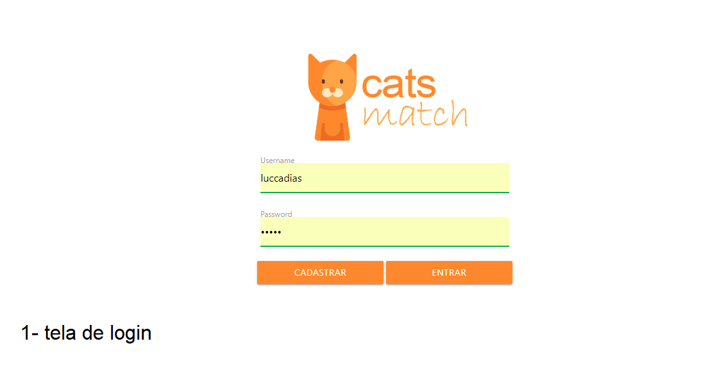

# Detalhamento dos componentes

## Camada de Apresentação

## Camada de Dados

## Mapa de Navegação

Tela de Login: O usuario que já tem cadastro pode realizar o login e clicar em entrar.

Tela de Cadastro: O usuario pode se cadastrar para ter acesso ao site e adotar um gato. Basta colocar email, senha e nome de usuario.

Tela de Consulta: Voce pode olhar todos os gatos que estão disponiveis para adoção e dar like para conversar com o dono do animal.

Tela de Cadastro de Gatos: Voce pode cadastrar gatos para serem adotados, só colocar o nome do gato, foto, idade e a descrição.

Tela de Match: Todos os gatos que voce deu like irão aparecer para voce conversar com o dono do gato.

